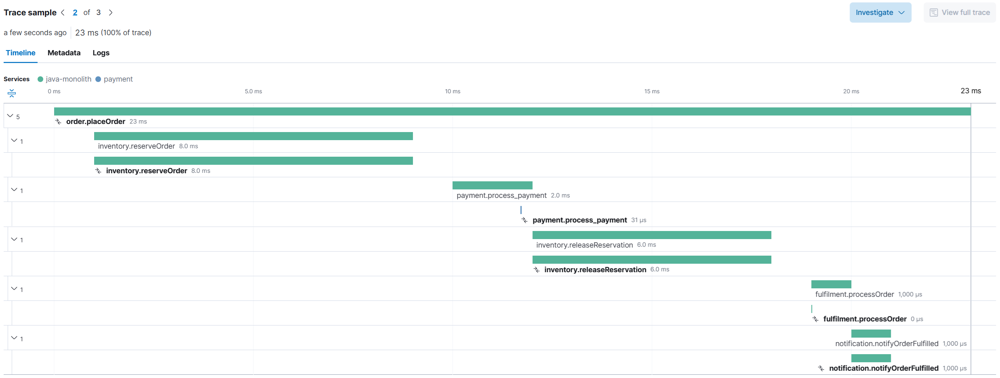
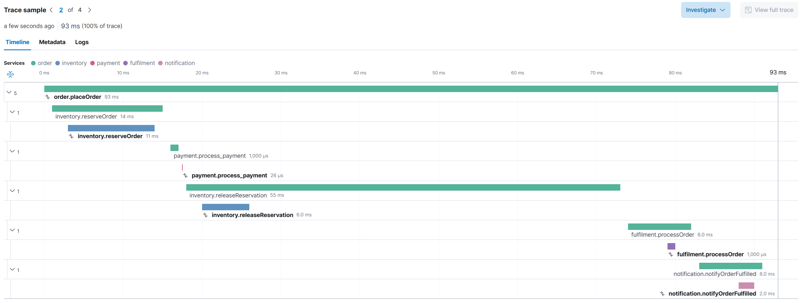
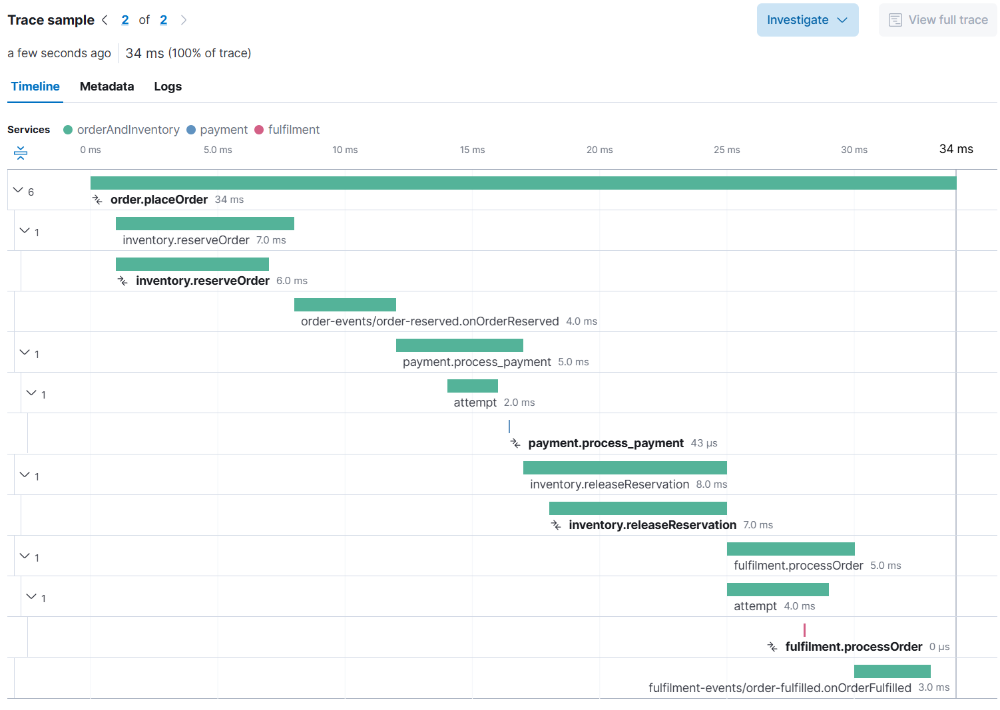

# Itara

**Make software soft again.**

Itara is a compiler and linker for distributed system topology. It treats topology — how components connect, communicate, and are observed — as a concentrated, separately declared layer, not a consequence of how code was written.

This is achieved through two co-equal parts: a language-specific wiring agent that reads the wiring config before the application starts, resolves all connections once, wires the components together, and then steps aside — the application runs at full speed with no intermediary, no proxy in the call path, no decisions made at call time — and a tooling ecosystem that makes the topology layer safe and manageable. The tooling validates configurations before deployment, catches mismatches and incompatibilities at authoring time, visualises the topology as a graph, and guides engineers through changes. Incorrect topologies cannot be deployed silently. The layer Itara introduces is the layer the tooling understands completely.

Change how your components communicate — collocated direct calls, HTTP, message queues — by changing a config file. No code changes. No redeployment ceremony. No migration scripts. Reference implementations of the wiring agent exist in Java and Rust. More languages are planned. The tooling ecosystem has begun: `itara-cli` ships two commands — `itara inspect` to visualise a topology and `itara verify` to catch configuration errors before deployment. The visual editor and controller are planned.
 
---
 
## Contents
 
- [The problem](#the-problem)
- [The idea](#the-idea)
- [Gradual adoption](#gradual-adoption)
- [The proof of concept](#the-proof-of-concept)
- [Language support](#language-support)
- [Observability](#observability)
- [Repository structure](#repository-structure)
- [The demo](#the-demo)
- [Running the Rust demo](#running-the-rust-demo)
- [The CLI](#the-cli)
- [Current state](#current-state)

---

## The problem

### The pain

Changing how components in a distributed system communicate is painful and dangerous — it means changing code on both sides, finding all the clients that call a particular service, identifying the relevant code owners and teams, making a step-by-step plan, and coordinating the effort across teams. Even in the most well-designed systems, it is a very significant and time-consuming effort. Most of us have been there: mark an API deprecated, replace it everywhere you know it's called, and then spend a week watching the monitoring — hoping nothing you did not know about would call it. When nothing does, you delete it and move on, never quite sure whether you were thorough enough or just got lucky. There are ways to mitigate the risk: parallel runs, rollback plans, coordinated change freezes, additional observability during migration, the strangler fig pattern — we do them routinely. But none of them tackle the real issue. They only mitigate the consequences.

### The root cause

The topology of a distributed system — which components exist, how they communicate, where they run — is not a first-class concern. It lives in HTTP clients, retry policies, timeout configurations, service discovery calls, Kafka consumer group registrations, schema registry entries: scattered across every service, encoded as a consequence of implementation decisions made years apart by people who may no longer be around. There is no place you can go to ask what the topology is right now, what depends on what, or what breaks if you move something. The blast radius of any topology change is very hard to determine, often impossible, until you are already committed to it.

See [VISION.md](spec/VISION.md) for the full analysis and
[MANIFESTO.md](spec/MANIFESTO.md) for the principles that follow from it.

---

## The idea

We've solved this pattern before — with configuration, with infrastructure as code. Topology is next.

Topology belongs in a dedicated, separately declared layer — not distributed across the codebase as a consequence of implementation decisions. Itara elevates and concentrates it there.

A component declares its contract — what it accepts and what it returns. It does not declare how it is called — that is declared in the wiring config. The wiring config is not a deployment detail. It is the authoritative representation of the system's architecture: which components exist, how they connect, what transport they use, expressed as a directed graph.

The Itara wiring agent reads the config at startup, prepares all connections exactly as declared, and then steps aside. No decisions are made at call time. The topology is fully determined before the first request arrives.

This is not about hiding the network or making remote calls look like local ones. Topology is explicit, not hidden — declared in the wiring config, validated by tooling before deployment, and visible to everyone. See the [FAQ](spec/FAQ.md) for how Itara compares to service meshes, sidecars, and transparency-oriented systems. See [SPEC.md](spec/SPEC.md) for the formal specification.

The wiring config for a two-component system looks like this:

```yaml
# One master config describes the entire topology.
# Each process is told which node it represents at startup.
# Change this file. Restart. Topology changes.

nodes:
  - id: gatewayNode
    component: gateway
  - id: calculatorNode
    component: calculator

connections:
  - from: gatewayNode
    to:   calculatorNode
    type: direct      # or: http, kafka — code does not change
```

---

## Gradual adoption
 
Itara is designed to be adopted incrementally — one component at a time, one service boundary at a time, without touching the rest of the system.
 
A component needs three things to participate:
 
- An **API artifact** — a plain interface declaring the contract
- An **activator** — a single factory method that receives the registry and returns the implementation
- A **wiring config entry** — declaring the node and its connections 

The only Itara dependency a component ever introduces is the core library — `itara-common` in Java, `itara-core` in Rust. The business logic
implementation itself requires no Itara imports at all. Only the activator, the single composition root of a component, touches the registry. Spring Boot works alongside Itara without any adapter — they operate at different layers and do not interfere with each other.
 
**With partial adoption**, even a single service boundary under Itara gives you structural observability on that connection, explicit topology declaration for those components, and the ability to switch transport without code changes.
 
**With full adoption**, the complete topology picture becomes available. The wiring config describes the entire system. The CLI derives all deployment groups, validates all connections, and detects compatibility issues before deployment. The blast radius of any topology change becomes determinable rather than estimated.
 
The full benefits require the full picture. The value of partial adoption is real and immediate.

---

## The proof of concept
 
Two components — a gateway and a calculator — implemented in both Java and Rust. Switch between direct and HTTP topology by changing one line in the wiring config. The component code does not change.
 
Direct topology — single process, zero network overhead:
 
```
[Gateway] add(3, 4) = 7
```
 
HTTP topology — separate processes, transport cost visible in the traces:
 
```
[Itara/HTTP] -> add on calculator at localhost:8081
[Gateway] add(3, 4) = 7
```
 
This works across languages. A Java gateway calling a Rust calculator produces a single distributed trace in Kibana — the same trace ID, correct parent-child relationships, across two runtimes. The code in either component does not change.
 
The order processing demo below shows the full picture: five Java components, one Rust service, three topologies, and the traces that make each topology decision measurable.

---

## Language support

| Language | Status | Notes |
|----------|--------|-------|
| Java | Reference implementation | JVM agent, full observability, Spring Boot compatible |
| Rust | Working implementation | Transport SPI, config parser, agent library |
| Go | Planned | — |
| Python | Planned | — |
| C++ | Planned | — |

Components in different languages participate in the same topology graph and produce the same distributed traces.

---

## Observability

Itara treats observability as a first-class citizen. Every component call produces four events regardless of transport:

| Event | Side | Fires |
|-------|------|-------|
| `CALL_SENT` | Caller proxy | When the business layer hands over the call to the topology layer |
| `CALL_RECEIVED` | Callee dispatcher | When the topology layer hands over the call to the business layer |
| `RETURN_SENT` | Callee dispatcher | When the business layer hands over the return to the topology layer |
| `RETURN_RECEIVED` | Caller proxy | When the topology layer hands over the return to the business layer |

The placement is deliberate. The outer span (CALL_SENT → RETURN_RECEIVED) measures the full round trip from the caller's perspective. The inner span (CALL_RECEIVED → RETURN_SENT) measures pure component processing time, independent of transport. The gap between them is the transport overhead — serialization cost, network latency, deserialization cost — directly measurable without a single line of monitoring code. This is possible because the topology layer and the business layer have a clear boundary — and that boundary is precisely where these events fire.
 
Switching a connection from direct to HTTP changes the latency numbers in the traces. Nothing else changes. Topology decisions have a measurable cost, visible before you commit to them.

**OpenTelemetry** is built in for the Java implementation. Distributed traces appear in Kibana with correct parent-child relationships across JVMs, using W3C traceparent headers for propagation. The Rust implementation has working OTel support — including cross-language traces spanning Java and Rust processes — at proof of concept level, planned for a redesign before production use.
 
See [ADR 0003](docs/adr/0003-four-event-observability-model.md) for the full observability model, [ADR 0010](docs/adr/0010-observability-fired-by-agent-not-transport.md) for why the events fire where they do, [ADR 0013](docs/adr/0013-rust-dynamic-approach-evaluation.md) for the Rust implementation state, and [ADR 0014](docs/adr/0014-itara-native-correlation-ids.md) for the correlation ID model.

---

## Repository structure

```
java/          Java reference implementation (JVM agent, Spring Boot compatible)
rust/          Rust implementation (transport SPI, config parser, agent library)
  itara-cli/   CLI tooling — itara inspect and itara verify
docs/
  adr/         Architecture Decision Records
spec/          VISION.md, MANIFESTO.md, SPEC.md
```

---

## The demo

An order processing system — four Java components and a Rust payment service — running in three different topologies. The same components, the same business logic, the same code. Only the wiring config changes.

| Topology | What runs together | What the traces show |
|----------|-------------------|----------------------|
| Monolith | Order, inventory, fulfilment, notification colocated | Near-zero overhead on direct calls, network cost to Rust payment visible |
| Microservices | Every component in its own container | Transport overhead on every call, measurable on both sides |
| Informed | Order and inventory colocated, rest distributed | Inventory overhead gone, cross-language trace unchanged |

The Rust payment service appears in the same distributed trace as the Java components — a single Kibana trace spanning two languages, two runtimes, one topology.

**Monolith** — four Java components colocated, Rust payment separate:



**Microservices** — every component in its own container:



**Informed** — order and inventory colocated, rest distributed:



See [demo/README.md](demo/README.md) for full setup and run instructions.

## Running the Rust demo

This is a minimal Rust quickstart using the calculator proof of concept.

```bash
cd rust

# Direct topology
ITARA_CONFIG=../demo/wiring-direct.yaml \
ITARA_NODES=gatewayNode,calculatorNode \
cargo run -p gateway-component --bin gateway

# HTTP topology — two terminals
ITARA_CONFIG=../demo/wiring-http.yaml ITARA_NODES=calculatorNode \
cargo run -p calculator-component --bin calculator-server

ITARA_CONFIG=../demo/wiring-http.yaml ITARA_NODES=gatewayNode \
CALCULATOR_URL=http://127.0.0.1:8081 \
cargo run -p gateway-component --bin gateway
```

## The CLI
 
Introducing a topology layer creates an obligation: a wiring config that can
be misconfigured silently is not a step forward. `itara-cli` is the first
piece of the tooling ecosystem — it makes the topology layer safe to operate
before anything runs.
 
### itara inspect
 
Reads the wiring config and renders the topology: nodes, connections,
transport types, and — most usefully — derived deployment groups.
 
```bash
./rust/target/release/itara inspect demo/wiring-monolith.yaml
```
 
Deployment groups are the sets of components that must be colocated in the
same process because they are connected by direct calls. Itara derives them
automatically from the connection graph. They are the practical output that
answers the deployment question: what goes together, what runs separately,
what needs to start before what. The basis for generating Docker Compose
services, Kubernetes manifests, and startup ordering.
 
```
Deployment groups (derived):
  Group A: orderNode, inventoryNode
    orderNode (order)         — calls inventoryNode via direct
    inventoryNode (inventory) — receives orderNode via direct
  Group B: paymentNode
    paymentNode (payment)     — receives orderNode via http on :8083
```
 
Without Itara, this picture has to be reconstructed by reading code.
With Itara, it is derivable from the config before a single container starts.
 
### itara verify
 
Validates the logical correctness of the wiring config. Catches errors at
authoring time — before a container starts, before a process fails at
startup with a cryptic error.
 
```bash
./rust/target/release/itara verify demo/wiring-monolith.yaml
```
 
Checks performed: orphaned nodes, undeclared node references in connections,
duplicate node identifiers, self-connections, unknown transport types. Exits
non-zero on any error, making it a natural CI gate — a topology that does
not pass verify does not deploy.
 
See [SPEC §12](spec/SPEC.md#12-tooling) for the full tooling specification
and [ADR 0008](docs/adr/0008-metadata-file-over-meta-inf.md) for the
metadata format the CLI reads.

---

## Current state

**Working:**
- Direct and HTTP topologies in Java and Rust
- Cross-language topology (Java ↔ Rust over HTTP)
- Master wiring config — one file, each process self-selects its slice
- Inbound HTTP server — any component can accept external calls via config
- JSON serializer (pluggable via SPI)
- Four-event observability model — fully implemented in Java across all transports; Rust at proof of concept level.
- OpenTelemetry bridge — distributed traces in Kibana across JVMs and Rust processes
- W3C traceparent propagation
- Spring Boot compatible — components as Spring beans fetched from the Itara registry
- YAML wiring config with environment variable substitution
- itara-cli — `itara inspect` visualises topology and deployment groups, `itara verify` catches configuration errors before deployment

**Planned:**
- Kafka transport
- Language-neutral contract descriptor — a shared way to define component contracts across languages is needed for full language neutrality; protobuf integration is the planned first approach
- Controller (Orca) for runtime topology management
- Service discovery integration

See [VISION.md](spec/VISION.md) for the full architectural vision and [SPEC.md](spec/SPEC.md) for the formal specification.

---

## Author

Gabor Kiss — concept, architecture, initial implementation. April 2026.

## License

Apache License 2.0 — see LICENSE.
