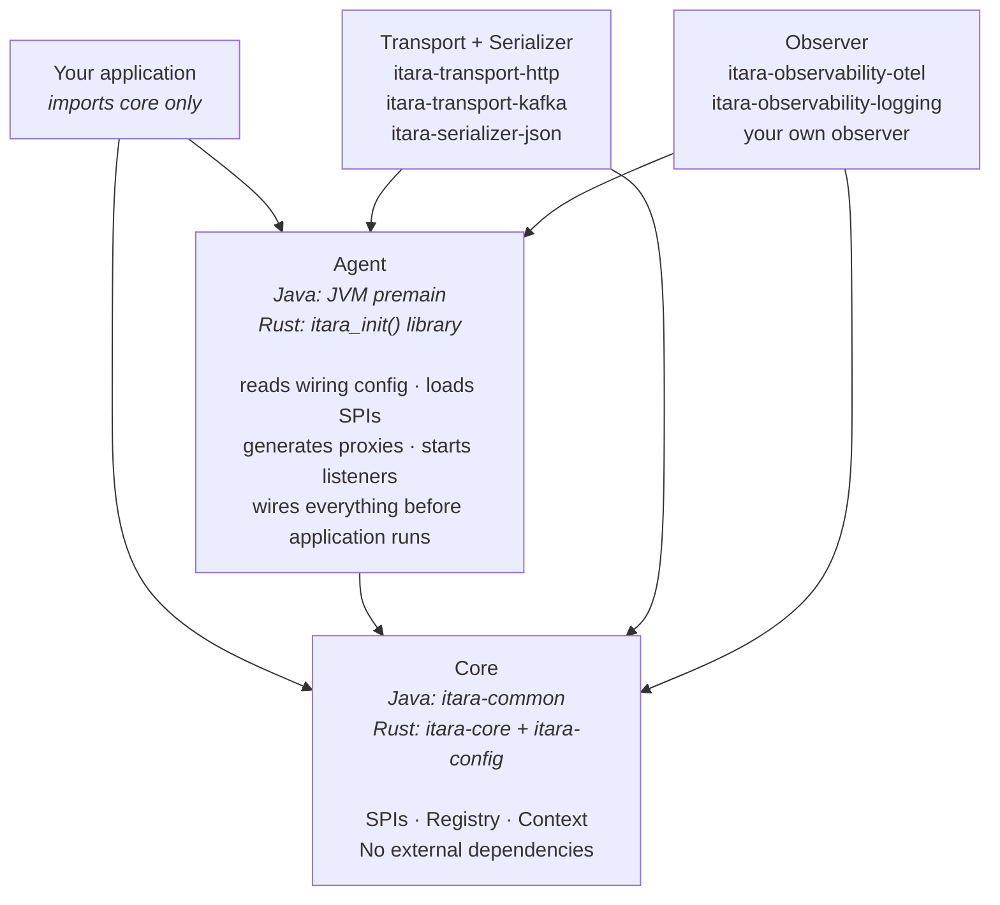
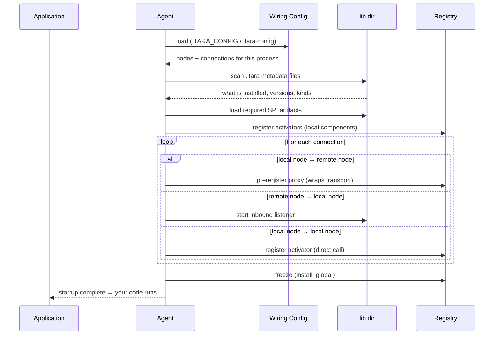
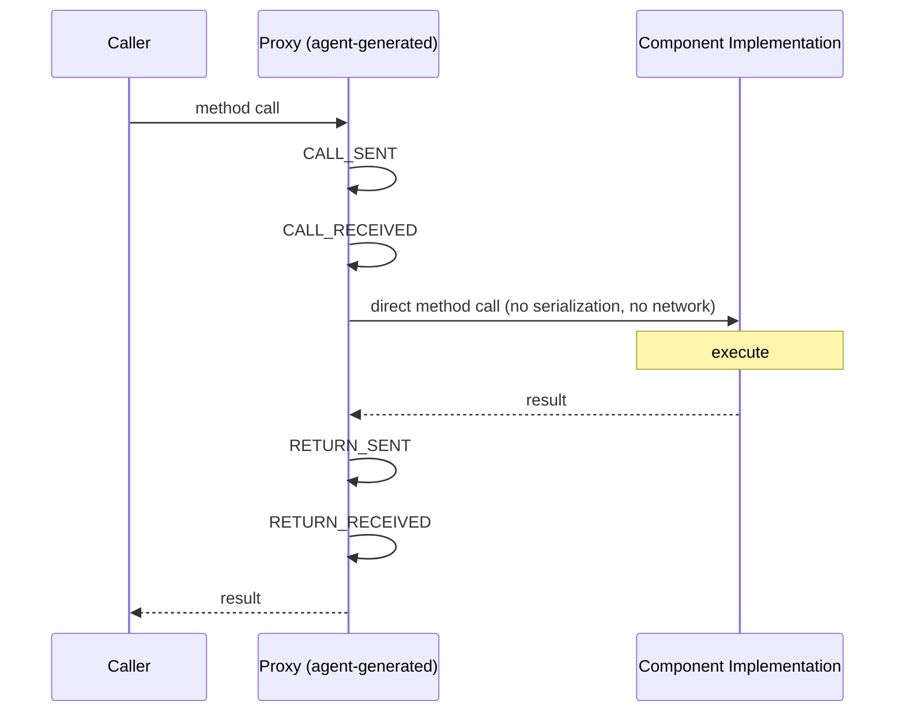
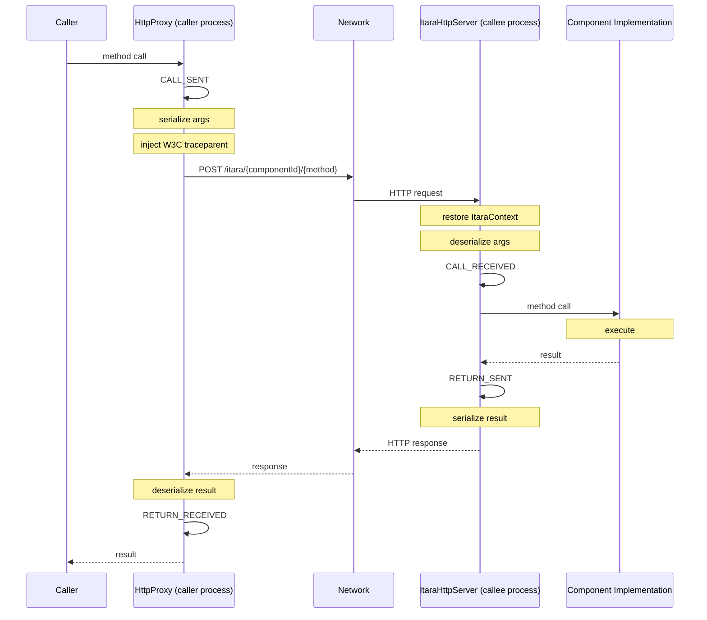

# Itara — Architecture

This document describes the module structure, layering rules, startup sequence, and request flow of the Itara runtime. It is the starting point for contributors who want to understand how the pieces fit together before reading the code.

For the full design rationale and principles, read [MANIFESTO.md](MANIFESTO.md) and [VISION.md](VISION.md) first. For the formal specification of every interface and contract, read [SPEC.md](SPEC.md). For the reasoning behind specific decisions, read the [Architecture Decision Records](../docs/adr/).

---

## The core idea in one paragraph

The Itara agent runs before application code. It reads a wiring config, discovers SPI implementations, generates proxies and listeners for each declared connection, and registers everything in the component registry — before the application handles its first request. By the time your entry point executes, the topology is fully wired. Component code calls other components through plain interface references and never knows whether the call goes in-process or across a network — or which language the other component is written in.

---

## Layers

Itara has four layers. The dependency rule is strict: lower layers know nothing about upper layers. All arrows point downward.

- **Your application** — calls components via interfaces, imports core only
- **SPI implementations** — transports, serializers, observers, loaded at runtime
- **Agent** — reads config, loads SPIs, wires everything before application runs
- **Core** — SPIs, registry, context, no external dependencies



---

## Language implementations

Itara is a specification with multiple language implementations. The layering above applies to all of them.

| Layer | Java | Rust |
|-------|------|------|
| Core | `itara-common` | `itara-core`, `itara-config` |
| Agent | `itara-agent` (JVM premain) | `itara-agent` (`itara_init()` library) |
| HTTP transport | `itara-transport-http` | `itara-transport-http` |
| JSON serializer | `itara-serializer-json` | planned |
| OTel observability | `itara-observability-otel` | planned |

Components in different languages participate in the same topology graph. A Java gateway and a Rust calculator connect over HTTP using the same wiring config. The distributed trace shows both spans.

---

## Java module structure

```
java/
  itara-common/                SPIs, registry, ItaraContext, OtelBridge, ObservabilityFacade
  itara-agent/                 JVM premain, classloader, wiring, SPI loading
  itara-transport-http/        HTTP transport
  itara-serializer-json/       JSON serializer (shaded Jackson)
  itara-serializer-java/       Java serializer (legacy opt-in)
  itara-observability-otel/    OTel bridge — distributed traces
  itara-observability-logging/ Structured event logging
  itara-integration-tests/
  itara-demo/                  Calculator and gateway demo components
```

## Rust crate structure

```
rust/
  itara-core/             ItaraComponent, ItaraRegistry, all SPIs
  itara-config/           YAML wiring config parser, env var substitution
  itara-agent/            itara_init(), itara_get(), itara_run()
  itara-transport-http/   HTTP transport implementation
  calculator-api/         CalculatorService trait + generated proxy + dispatcher
  calculator-component/   CalculatorServiceImpl + activator + standalone server binary
  gateway-api/            GatewayService trait
  gateway-component/      GatewayServiceImpl + activator + demo entry point binary
```

---

## Key concepts

**Contract** — an interface/trait that defines what a component does. Says nothing about how it is called. Lives in an API artifact. Callers depend only on this.

**Component** — one implementation of a contract. Has no knowledge of transport or topology.

**Activator** — instantiates the component and wires its dependencies from the registry. The single composition root per component.

**Node** — a deployment identity. Declared in the wiring config with an id and a component. One component can run as multiple nodes with different topologies. How many instances of a node are running is the orchestrator's concern — not Itara's.

**Master wiring config** — a single YAML file describing the complete topology. Each process reads the same file and self-selects its relevant slice based on which nodes it is responsible for. One source of truth.

**lib dir** — a directory of SPI artifacts loaded by the agent at startup. Each artifact ships a `.itara` metadata file so the agent understands what it contains before loading anything. Transports, serializers, and observers go here. The application never declares them as direct dependencies.

---

## Startup sequence

Before application code runs:



The invariant: by the time the first application thread runs, the topology is fully wired, validated, and all inbound listeners are started. Topology errors surface at startup with clear messages — never at call time.

---

## Request flow

### Direct call (same process)

In a direct connection, the caller holds a reference to a proxy. The proxy is responsible for firing observability events and then calling the implementation directly — no serialization, no network. The proxy is what makes observability structural: it cannot be bypassed.



No serialization. No network. Zero transport overhead. The proxy fires all four events and calls the implementation directly. The component implementation is unaware of the proxy — it just executes. The four events are structural properties of the platform that cannot be removed.

### HTTP call (separate processes)



---

## Observability event model

Every component interaction — direct or transport, Java or Rust — emits four events. The placement of events relative to serialization is intentional and load-bearing (see [ADR 0010](../docs/adr/0010-observability-fired-by-agent-not-transport.md)):

| Event | Side | Fires |
|-------|------|-------|
| `CALL_SENT` | Caller proxy | Before serialization |
| `CALL_RECEIVED` | Callee dispatcher | After deserialization |
| `RETURN_SENT` | Callee dispatcher | Before serialization of result |
| `RETURN_RECEIVED` | Caller proxy | After deserialization of result |

Everything transport-related — serialization, network, deserialization — happens between these events. This means:

- **Caller span** (CALL_SENT → RETURN_RECEIVED): full round trip including serialization cost on both sides
- **Callee span** (CALL_RECEIVED → RETURN_SENT): pure component processing time, independent of serialization format or transport
- **Serialization cost**: visible as the gap between CALL_SENT and bytes leaving the process, and between bytes arriving and CALL_RECEIVED
- **Network latency**: visible as the gap between bytes sent and CALL_RECEIVED on the callee side

Itara's own overhead is directly measurable. The data that justifies adoption is the same data that Orca uses to make topology decisions.

Observability events are fired by the proxy/dispatcher layer — not by the transport. A transport that skips observability cannot exist because the transport never touches the event model. See [ADR 0010](../docs/adr/0010-observability-fired-by-agent-not-transport.md).

---

## SPI pattern

All SPI types follow the same pattern in both Java and Rust:

- Implementation artifacts live in the lib dir
- Each artifact ships a `.itara` metadata file declaring its kind, id, version, and compatibility
- The agent reads all metadata files before loading any artifact — validation happens before execution
- The agent loads only what the wiring config requires
- Loaded implementations register with their respective SPI registry in core

The `.itara` metadata file format is the same across all languages. Java's META-INF/itara mechanism will be replaced by this format. See [ADR 0008](../docs/adr/0008-metadata-file-over-meta-inf.md).

---

## Hard constraints

These are not guidelines — they are architectural invariants:

- **Core has no external dependencies.** If a proposed change requires adding a dependency to `itara-common` or `itara-core`, the design is wrong.
- **Application code imports core only.** It never imports the agent or any SPI implementation directly.
- **SPI implementations never import each other.** Transport does not import serializer. Observer does not import transport. They are connected by the agent.
- **No topology decisions at call time.** Proxies, serializers, and listeners are resolved at startup. Nothing is looked up during request handling.
- **Observability is fired by the proxy/dispatcher layer, not the transport.** Transports move bytes. Observability is the agent's responsibility. See [ADR 0010](../docs/adr/0010-observability-fired-by-agent-not-transport.md).
- **Direct calls add zero transport overhead.** The proxy adds only the four observability events — non-optional and non-removable.
